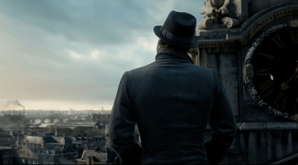

# The secrets code of Dumbledore

Once upon a time there was a powerful and wise wizard who was looking for a very special code. This code would rewrite their History, change their world forever. His name was Dumbledore and he build an army to get throught the land of JavaScript where he was hoping to find one of the Coding Horcruxes. Could they get throught all the challenges and dangers?

That will not be the most easier thing, but they will do their best and learn from their errors. After spending 1 week in the git plain, they finally find the first Coding Horcruxes.
The next step is to find the others ones, but where should they go ?

They knew that this horcrux belonged to the one whose code cannot be pronounced... no time to think if they wanted to thwart his plans, they had very little time to find the others. They set off towards the mountains of html where they had heard from a strange wizard belonging to the order of css that the second horcrux was down there.

But there was a vile creature hidding in the water, guarding the door that'll lead them into the cave, waiting to drow our poor heroes with its tentacles! But thanks to their coding powers they defeated it and so they entered the cave! But what other **dangers** awaits them? :open_mouth:

After nearly an hour, walking in the dark and cold of the cave, a light appeared at the end of this endless corridor.
*Let's see where it leads.* Horace says. 

